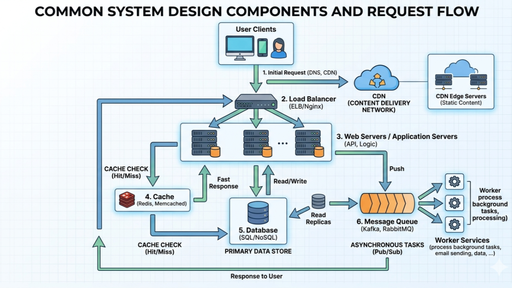

# System Design Study Group

A collection of notes, concepts, and hands-on mini projects from a weekly system design study group hosted by [Google Developer Groups On Campus (GDGC)](https://www.instagram.com/gdgcpp/) at Cal Poly Pomona. Each topic folder contains a concept reference and one or more labs — short, runnable projects designed for "learning by doing."

> [!note]
> The following notes are generally high-level overviews of general system design concepts, and this repo aims to be both a personal reference and a demonstration of such core topics.
>
> Diagrams and images used throughout this repo are sourced from their respective owners and are not original unless otherwise noted. Sources are credited inline where images appear.


_Source: [Software Engineer Growth - Quoc Viet Ha](https://www.linkedin.com/pulse/system-design-basic-part-2-common-components-quoc-viet-ha-qwluc/)_

## 🏛️ Core Pillars

Every system design decision ultimately traces back to one or more of these three goals.

**High Availability** — the system stays operational and accessible as much of the time as possible, even in the face of failures. Achieved through redundancy, replication, failover, and health monitoring. Expressed as uptime percentages — 99.9%, 99.99%, etc.

**High Scalability** — the system can grow to handle increasing load, either vertically (upgrading hardware) or horizontally (adding more machines). Good scalability means growth doesn't require rearchitecting from scratch.

**High Throughput** — the system can process a large number of requests in a given time period. Measured in QPS (queries per second) or TPS (transactions per second). Bottlenecks anywhere in the stack — the network, application layer, or database — can cap throughput regardless of how much hardware you throw at the problem.

These three goals are intertwined — a well-designed system pursues all three simultaneously, and the strategies that address one often reinforce the others. The tension between them is where most real system design decisions live.

## 📁 Covered Topics

### [Networking](./networking/)

The foundational layer — how devices communicate, how data is addressed and routed, and the tradeoffs between reliability and speed.

**Concepts:** IP addresses, subnets & NAT, OSI model (all 7 layers), TCP vs UDP

**Lab:** [`tcp-vs-udp`](./networking/tcp-vs-udp.md) — observe TCP's guaranteed delivery and UDP's silent packet loss side by side

---

### [Load Balancers](./load-balancers/)

How incoming traffic is distributed across multiple servers to maximize performance, reliability, and scalability, and what happens when servers go down.

**Concepts:** (Weighted) round robin, least connections, IP hashing, health checks, Layer 4 vs Layer 7

**Lab:** [`load-balancer`](./load-balancers/load-balancer.md) — build a working HTTP load balancer in Python with weighted round robin, least connections, and automatic health checks with server recovery

---

### [DNS & Proxies](./dns-and-proxies/)

How domain names get resolved to IP addresses, and how proxies intercept and improve that process — making lookups faster, more secure, and more private.

**Concepts:** DNS hierarchy, the 4 DNS server roles, record types, TTL, recursive vs authoritative resolvers, DNS proxies

**Lab:** [`dns-proxy`](./dns-and-proxies/dns-proxy.md) — build a UDP DNS proxy that forwards queries upstream to Cloudflare, caches responses with TTL, and logs cache hits and misses

---

### [CDN, Caching & Availability](./cdn-caching-availability/)

How content is delivered fast at global scale, how caching fits into the bigger picture, and how systems stay online when things fail.

**Concepts:** CDN architecture, edge servers, points of presence, CDN vs caching, cache hit/miss ratio, Cache-Control headers, TTL, cache invalidation, eviction strategies (LRU/LFU/FIFO), high availability, failover, DDoS protection

**Lab:** [`cache-simulator`](./cdn-caching-availability/cache-simulator.md) — simulate CDN edge cache behavior across cold start, warm cache, manual invalidation, and TTL expiry with hit ratio tracking

---

## 🧱 Foundational Concepts

Smaller concepts that came up across sessions and are covered within the most relevant topic folder rather than having their own dedicated space.

| Concept                                    | Covered In                                                 |
| ------------------------------------------ | ---------------------------------------------------------- |
| IP addresses, public vs private, ports     | [Networking](./networking/)                                |
| Subnets & NAT                              | [Networking](./networking/)                                |
| OSI model — all 7 layers                   | [Networking](./networking/)                                |
| TCP vs UDP                                 | [Networking](./networking/)                                |
| DNS record types & TTL                     | [DNS & Proxies](./dns-and-proxies/)                        |
| Cache-Control headers                      | [CDN, Caching & Availability](./cdn-caching-availability/) |
| Cache eviction strategies (LRU, LFU, FIFO) | [CDN, Caching & Availability](./cdn-caching-availability/) |
| High availability & uptime nines           | [CDN, Caching & Availability](./cdn-caching-availability/) |

## ⚡ Getting Started

Each folder contains a `README.md` discussing the respective topic, and each lab has its own markdown file with setup instructions, expected output, etc.

All labs are written in Python 3 with minimal dependencies. Any additional setup will be outlined in the lab's markdown file.

```bash
cd <topic-folder>
python3 <filename>.py
```

## 📚 Key Resources

Resources for going deeper on system design beyond this repo:

- [System Design Primer](https://github.com/donnemartin/system-design-primer) — open-source reference to prep for system design interview
- [AlgoMaster (System Design)](https://algomaster.io/) — structured course with interview-focused breakdowns
- [ByteByteGo](https://bytebytego.com/guides/cloud-distributed-systems/) — visual system design guides and courses by authors of System Design Interview books
- [Cloudflare Learning Center](https://www.cloudflare.com/learning/) — resources on cybersecurity and Internet concepts
- [High Scalability](http://highscalability.com/) — a blog or resource hub dedicated to the art, science, and practice of building highly scalable websites and systems
- [MDN Web Docs (HTTP)](https://developer.mozilla.org/en-US/docs/Web/HTTP) — comprehensive HTTP reference
- [Designing Data-Intensive Applications](https://dataintensive.net/) — go-to book for deep dives into distributed systems, databases, and data engineering
