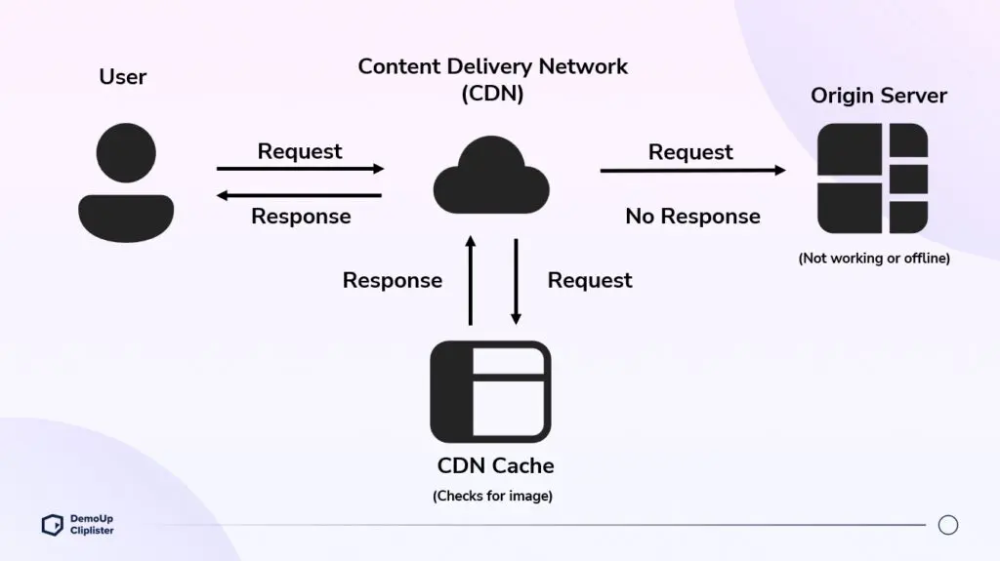
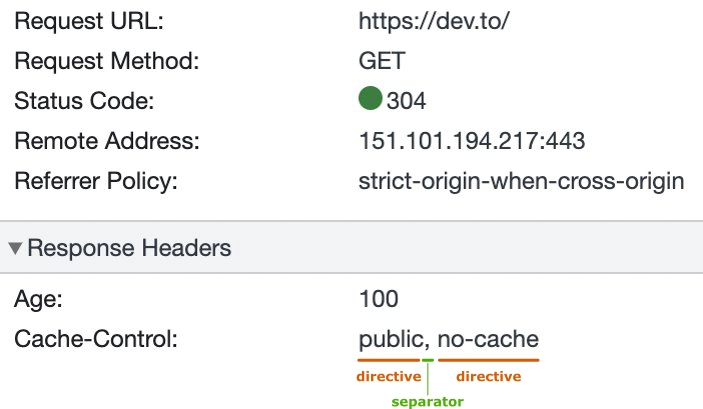

# CDN, Caching, & Availability

How the internet delivers content fast, keeps it close to users, and stays online even when things go wrong.

View [`cache-simulator.md`](./cache-simulator.md) to build an in-memory TTL cache and run a simulation that mirrors how a CDN edge cache behaves across cold start, warm cache, manual invalidation, and TTL expiry.

## 📦 Content Delivery Networks (CDNs)

### What is a CDN?

A **CDN (Content Delivery Network)** is a globally distributed network of proxy servers that caches and delivers content from locations close to the user, rather than always fetching from a single origin server that might be on the other side of the world. The site's DNS resolution tells clients which edge server to contact.

CDNs primarily serve **static content** — HTML, CSS, JS, images, and videos — since these files are the same for every user and cache well. Some CDNs like Amazon CloudFront also support **dynamic content**, though this requires more sophisticated configuration since dynamic responses often can't be cached and must be proxied to the origin on every request.

```
Without CDN:                        With CDN:
─────────────                       ─────────
User in Singapore                   User in Singapore
        │                                   │
        │ ~200ms                            │ ~10ms
        ▼                                   ▼
Origin server (US)              Edge server (Singapore)
                                        │ (cache miss only)
                                        ▼
                                Origin server (US)
```

**Netflix Open Connect**

Netflix runs its own CDN called **Open Connect**. Rather than paying third-party CDNs, Netflix places thousands of servers _inside_ ISP networks around the world. Hosting media closer to the users improves streaming quality, lowers costs for ISPs, and ensures efficient data delivery.

### Key Components

**Origin Server** — The authoritative source of your content. This is your actual web server or application backend. Every piece of content starts here. The CDN reduces how often clients need to hit it directly.

**Edge Servers** — Servers deployed at the geographic _edge_ of the network, close to end users. These are what actually serve requests in most cases. CDNs like Cloudflare and Akamai have hundreds of edge servers worldwide.

**Points of Presence (PoPs)** — Physical data center locations where edge servers are deployed. A CDN's PoP map determines which regions it can serve efficiently. More PoPs = lower latency for more users globally.

### Cache Hit vs Cache Miss

When a user requests content from an edge server:

```
Request arrives at edge server
        │
        ├── Content in cache + not expired?
        │         │
        │         ▼
        │     Cache HIT ✅ → serve immediately from edge
        │
        └── Not cached or expired?
                  │
                  ▼
              Cache MISS ❌ → fetch from origin, cache it, serve to user
```

A **cache hit ratio** of 95–99% is typical for a well-configured CDN, meaning the origin server only has to handle 1–5% of total traffic.

```
      Cache Hits
───────────────────────── = Cache Hit Ratio
Cache Hits + Cache Misses
```

### Disadvantages of CDNs

- **Cost** — CDN services charge based on bandwidth and requests, which grows significantly with scale. Building a proprietary CDN like Netflix is an option, but requires enormous investment.
- **Not effective for dynamic or personalized content** — CDNs shine when many users request the same thing. Content unique per user (dashboards, account pages, real-time data) can't be cached and gains little benefit.
- **CDN outages affect everyone** — if you rely heavily on a CDN and it goes down, your site goes down with it. Major CDN providers (Cloudflare, Fastly) have had outages that took down large portions of the internet simultaneously.
- **Cache invalidation is hard** — purging stale content across a globally distributed CDN can be slow, inconsistent, and difficult to verify.
- **Debugging complexity** — issues can originate at the CDN layer, the origin, or anywhere in between. Adding a CDN introduces another system to monitor and debug.

## 🗃️ Caching

### What is Caching?

**Caching** is the practice of storing a copy of data in a faster or closer location so future requests can be served more quickly. It's one of the most impactful performance optimizations in system design.

```
Without caching:   Every request → origin server → slow
With caching:      First request → origin → cache it
                   All future requests → cache → fast ✅
```


_Source: [DemoUp Cliplister](https://www.demoup-cliplister.com/en/blog/cdn-vs-caching-differences/)_

### CDN vs Caching

Caching is the mechanism, storing data for faster access. A CDN is an infrastructure layer that applies caching geographically across a global network of servers, while also handling routing, failover, DDoS protection, and more. Browser caching and application caching exist entirely independently of any CDN.

|                    | CDN                                 | Caching                                   |
| ------------------ | ----------------------------------- | ----------------------------------------- |
| **What it is**     | A distributed network of servers    | A technique for storing data temporarily  |
| **Where**          | Edge servers worldwide              | Anywhere — browser, server, database, CDN |
| **Content type**   | Primarily static, some dynamic      | Primarily static, dynamic requires care   |
| **Location**       | Geographically distributed          | Local to the device or server             |
| **Implementation** | Requires a CDN provider, DNS config | HTTP headers, caching libraries, Redis    |

### Layers of Caching

Caching happens at multiple levels in a typical web request.

| Layer             | Where         | What's Cached                         |
| ----------------- | ------------- | ------------------------------------- |
| Browser cache     | Client device | HTML, CSS, JS, images                 |
| CDN cache         | Edge server   | Static repo-figures, entire responses |
| Application cache | Server memory | DB query results, computed data       |
| Database cache    | DB engine     | Query results (e.g. Redis, Memcached) |

**Browser cache** — Your browser stores copies of files on your local hard drive. On your next visit, it loads repo-figures from disk rather than re-downloading them.

**CDN cache** — An edge server stores responses from the origin. Serves subsequent users asking for the same content without contacting the origin at all.

**Application cache** — Tools like **Redis** or **Memcached** sit in front of a database, storing the results of expensive queries in memory. If the same query comes in again, the result is returned from memory in microseconds rather than hitting the database.

### Cache-Control Headers

`Cache-Control` is an HTTP response header that tells browsers and CDNs how to cache a response.

| Common Directives | Meaning                                              |
| ----------------- | ---------------------------------------------------- |
| `public`          | Any cache (browser, CDN, proxy) may store this       |
| `private`         | Only the client browser may cache this, not CDNs     |
| `no-cache`        | Must revalidate with server before using cached copy |
| `no-store`        | Do not cache at all (sensitive data)                 |
| `max-age=N`       | Cache for N seconds                                  |
| `s-maxage=N`      | CDN-specific max age (overrides `max-age` for CDNs)  |


_Source: [Yishai Zehavi (DEV)](https://dev.to/yishai_zehavi/http-caching-explained-part-1-theory-3j4m)_

### TTL — Time To Live

**TTL** is how long a cached item is considered valid. Once it expires, the next request triggers a fresh fetch from the origin.

- **Short TTL** → more up-to-date content, but more origin requests and higher latency
- **Long TTL** → fewer origin requests and faster responses, but stale content lingers longer

For static repo-figures that rarely change (logos, fonts, JS bundles), long TTLs (days or weeks) are ideal. For dynamic content (news feeds, user data), short TTLs or `no-cache` are more appropriate.

### Cache Invalidation

**Cache invalidation** is the process of deliberately removing or updating a cached entry before its TTL expires. This is necessary when content changes and you can't wait for natural expiry.

Common strategies:

- **Purge** — explicitly delete a cached item from the CDN (most CDNs have an API for this)
- **Cache busting** — change the URL when content changes (e.g. `app.v2.js`) so caches treat it as a new resource
- **Versioning** — embed a hash or version number in asset filenames (e.g. `app.3f9a2c.js`)

### Cache Eviction Strategies

When a cache reaches its memory limit, it must decide what to remove to make room for new entries. The strategy chosen has a significant impact on hit ratio.

**Least Recently Used (LRU)**

Evicts the entry that hasn't been accessed for the longest time. The assumption is that recently accessed items are more likely to be accessed again soon. Most commonly used in practice (Redis supports LRU eviction natively).

**Least Frequently Used (LFU)**

Evicts the entry that has been accessed the fewest times overall. Rewards genuinely popular content but can be slow to adapt when access patterns shift.

**First In, First Out (FIFO)**

Evicts the oldest entry regardless of how often it's been accessed. Simple to implement but often performs poorly since popular old entries get evicted unnecessarily.

**TTL-based eviction**

Entries are evicted when their TTL expires, regardless of memory pressure. Simple and predictable, but doesn't protect against memory exhaustion.

| Strategy | Evicts                    | Best For                             |
| -------- | ------------------------- | ------------------------------------ |
| LRU      | Least recently accessed   | General purpose — most common        |
| LFU      | Least frequently accessed | Stable, predictable access patterns  |
| FIFO     | Oldest entry              | Simple systems, less critical caches |
| TTL      | Expired entries           | Time-sensitive data                  |

### Disadvantages of Caching

- **Cache invalidation is notoriously difficult** — knowing when to evict or update a cached entry without serving stale data is one of the hardest problems in distributed systems.
- **Consistency issues** — in systems with multiple cache nodes, different nodes can hold different versions of the same data. Keeping them in sync requires careful coordination.
- **Cold start / cache stampede** — a fresh or restarted cache has no entries. The sudden flood of misses all hitting the origin simultaneously can temporarily overwhelm your backend.
- **Memory overhead** — caches consume RAM. Poorly tuned caches can grow unbounded and starve other processes of memory.
- **Can mask underlying problems** — heavily caching a slow database query makes the app feel fast without fixing the root cause. When the cache expires, the slow query resurfaces.
- **Stale data risk** — if a user writes data and immediately reads it back, they may get the outdated cached version. Especially problematic in write-heavy applications.

## 🟢 Availability & Reliability

### High Availability

**High availability (HA)** means a system remains operational and accessible the vast majority of the time. Typically expressed as a percentage of uptime over a year:

| Uptime                 | Annual Downtime |
| ---------------------- | --------------- |
| 99%                    | ~3.65 days      |
| 99.9% ("three nines")  | ~8.7 hours      |
| 99.99% ("four nines")  | ~52 minutes     |
| 99.999% ("five nines") | ~5 minutes      |

Most production systems target at least 99.9% while critical infrastructure (banking, healthcare, etc.) often target 99.999%.

### Geographic Distribution

CDNs naturally improve availability by distributing content across many locations. If an edge server in one region goes down, traffic is automatically routed to the nearest healthy one.

**Latency example:**

- Singapore user → US origin server: ~200ms (poor)
- Singapore user → Singapore edge server: ~5–10ms (excellent)

### Failover

**Failover** is the automatic process of switching traffic to a healthy server when the current one fails. When a backend server goes down, the remaining servers absorb its traffic automatically. At the CDN level, failover happens across entire data centers and regions transparently.

### Handling Traffic Spikes

CDNs are uniquely well-positioned to absorb sudden traffic spikes:

- **Caching** absorbs most requests at the edge before they reach the origin
- **Capacity distribution** spreads load across hundreds of edge servers globally
- **Auto-routing** directs traffic to the least-loaded edge server in a region

### DDoS Protection

A **DDoS (Distributed Denial of Service)** attack floods a server with massive traffic from many sources simultaneously to take it offline.

CDNs defend against this by:

- **Absorbing volume** — distributing attack traffic across a massive global network
- **Traffic filtering** — dropping packets with abnormal request rates or from flagged IPs at the network layer
- **Rate limiting** — capping request rates per IP to prevent any single source from dominating bandwidth

_Cloudflare routinely absorbs multi-terabit DDoS attacks that would instantly knock out most origin servers on their own._

## 🔗 Connecting Everything

A CDN improves availability (redundant edge servers), improves performance (caching near users), and reduces origin load (cache absorbs traffic) — all simultaneously.

```
User Request
     │
     ▼
CDN Edge Server ── Cache Hit? ──► Serve immediately (low latency, high availability)
     │
     │ Cache Miss
     ▼
Origin Server ── Healthy? ──► Serve + cache response at edge
     │
     │ Unhealthy
     ▼
Failover to backup origin ──► Serve + cache response
```

## 📚 Resources

- [MDN — HTTP Caching](https://developer.mozilla.org/en-US/docs/Web/HTTP/Caching)
- [DemoUp Cliplister — CDN vs Caching](https://www.demoup-cliplister.com/en/blog/cdn-vs-caching-differences/)
- [BlazingCDN — CDN Caching Mechanisms](https://blog.blazingcdn.com/en-us/exploring-cdn-caching-mechanisms)
- [AWS — High Availability and Scalability](https://docs.aws.amazon.com/whitepapers/latest/real-time-communication-on-aws/high-availability-and-scalability-on-aws.html)
- [Cloudflare — What is a CDN?](https://www.cloudflare.com/learning/cdn/what-is-a-cdn/)
- [Cloudflare — What is Caching?](https://www.cloudflare.com/learning/cdn/what-is-caching/)
- [Cloudflare — Cache Hit Ratio](https://www.cloudflare.com/learning/cdn/what-is-a-cache-hit-ratio/)
- [Yishai Zehavi (DEV) — Cache-Control Explained](https://dev.to/yishai_zehavi/http-caching-explained-part-1-theory-3j4m)
