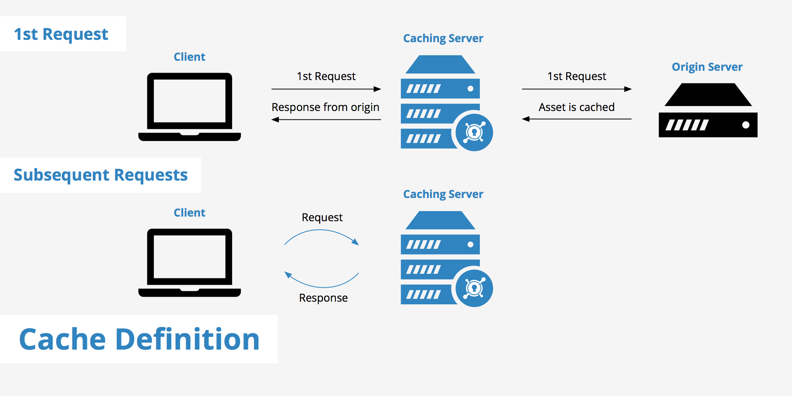

# CDN Cache Simulator

Build an in-memory TTL cache and run a simulation across four phases — cold start, warm cache, manual invalidation, and TTL expiry — mirroring how a CDN edge cache behaves.

This quick demonstration was implemented with the assistance of Claude.


_Source: [BlazingCDN](https://blog.blazingcdn.com/en-us/exploring-cdn-caching-mechanisms)_

## ⚙️ Configuration

At the top of `cache-simulator.py`:

```python
DEFAULT_TTL = 6  # in seconds (adjust to control entry expiry)
```

## ⚡ Getting Started

```bash
# Make sure you are in the right directory
cd cdn-caching-availability

# Run the demo with configs applied
python3 cache-simulator.py
```

> [!note]
> Due to the TTL expiry wait in Phase 4, program completes in about 10 seconds by default.

## 📍 Key Code Concepts

### The TTLCache Class

- Stores key-value pairs with an expiry timestamp
- Returns cached values on hit, `None` on miss or expiry (lazy eviction)
- Tracks hits and misses and computes a hit ratio
- Supports manual cache invalidation

```python
def set(self, key, value, ttl):
    self.store[key] = (value, time.time() + ttl)
```

The cache stores entries as `(value, expiry_timestamp)` tuples — an absolute timestamp rather than a countdown → never need to update entries over time, just compare against `time.time()` at lookup.

### Lazy Eviction

Expired entries aren't removed on a timer. They're evicted the moment they're accessed and found to be stale. This is a similar pattern used by Redis and other production caches:

```python
def get(self, key):
    if key in self.store:
        value, expiry = self.store[key]
        if time.time() < expiry:
            self.hits += 1
            return value
        else:
            del self.store[key]  # evict on access
    self.misses += 1
    return None
```

### Hit Ratio

Simple ratio of successful cache lookups to total lookups. A well-warmed CDN cache targets 95–99%.

```python
def hit_ratio(self):
    total = self.hits + self.misses
    return round((self.hits / total) * 100, 1) if total > 0 else 0.0
```

### The Four Simulation Phases

Each phase directly maps to a real CDN scenario.

```python
# Phase 1 — cold cache: all misses, everything fetched from origin
# Phase 2 — warm cache: all hits, nothing touches the origin
# Phase 3 — manual invalidation: one entry explicitly removed, becomes a miss
# Phase 4 — TTL expiry: wait for entries to expire, all misses again
```

### Connection to CDN Concepts

| Simulator              | Real CDN Equivalent                                 |
| ---------------------- | --------------------------------------------------- |
| Phase 1 (cold)         | Edge server just deployed or restarted, cache empty |
| Phase 2 (warm)         | Normal steady-state CDN operation                   |
| Phase 3 (invalidation) | Urgent content update pushed before TTL expires     |
| Phase 4 (expired)      | Content naturally aging out after TTL               |
| `TTLCache.get()`       | Edge server serving a cached asset                  |
| `TTLCache.set()`       | Edge server storing a fresh response from origin    |
| `fetch_from_origin()`  | CDN fetching from your web server on a cache miss   |
| `DEFAULT_TTL`          | `Cache-Control: max-age=N` response header          |
| `cache.invalidate()`   | CDN purge API call                                  |

## 📊 Expected Output

The forced expiry in Phase 4 of the simulation influences the low hit ratio. In a real CDN with sustained traffic and a warm cache, this climbs toward 95–99%.

```
========================================
  CDN Cache Simulator
========================================

[Phase 1] First-time requests
────────────────────────────────────────
2026-03-31 13:32:19,164 - INFO -   MISS │ github.com           → 140.82.114.4 (fetched from origin, TTL 6s)
2026-03-31 13:32:19,323 - INFO -   MISS │ google.com           → 142.250.80.46 (fetched from origin, TTL 6s)
2026-03-31 13:32:19,484 - INFO -   MISS │ cloudflare.com       → 104.16.132.229 (fetched from origin, TTL 6s)
2026-03-31 13:32:19,642 - INFO -   MISS │ openai.com           → 104.18.32.47 (fetched from origin, TTL 6s)
2026-03-31 13:32:19,800 - INFO -   MISS │ stripe.com           → 54.187.188.194 (fetched from origin, TTL 6s)

[Phase 2] Repeat requests
────────────────────────────────────────
2026-03-31 13:32:19,906 - INFO -   HIT  │ stripe.com           → 54.187.188.194
2026-03-31 13:32:20,011 - INFO -   HIT  │ github.com           → 140.82.114.4
2026-03-31 13:32:20,113 - INFO -   HIT  │ google.com           → 142.250.80.46
2026-03-31 13:32:20,217 - INFO -   HIT  │ google.com           → 142.250.80.46
...

[Phase 3] Manual cache invalidation
────────────────────────────────────────
2026-03-31 13:32:20,734 - INFO -   INVALIDATED → github.com
2026-03-31 13:32:20,789 - INFO -   MISS │ github.com           → 140.82.114.4 (fetched from origin, TTL 6s)

[Phase 4] Waiting 6s for TTL to expire...
────────────────────────────────────────
2026-03-31 13:32:27,847 - INFO -   MISS │ stripe.com           → 54.187.188.194 (fetched from origin, TTL 6s)
2026-03-31 13:32:27,950 - INFO -   HIT  │ stripe.com           → 54.187.188.194
2026-03-31 13:32:28,110 - INFO -   MISS │ cloudflare.com       → 104.16.132.229 (fetched from origin, TTL 6s)
2026-03-31 13:32:28,270 - INFO -   MISS │ openai.com           → 104.18.32.47 (fetched from origin, TTL 6s)

[Results]
────────────────────────────────────────
  Cache Hits:    9
  Cache Misses:  9
  Hit Ratio:     50.0%
  Cached items:  5
────────────────────────────────────────
```

## 🧪 Experimenting

**Increase TTL** — Set `DEFAULT_TTL = 60`. Phase 4's wait becomes impractical so comment out `time.sleep()`. You'll see a much higher hit ratio since nothing expires during the simulation.

```
[Results]
  Cache Hits:    9
  Cache Misses:  6
  Hit Ratio:     60.0%
  Cached items:  5
```

**Increase request volume** — Change `k=8` to `k=50` in Phase 2. The hit ratio climbs significantly since the same 5 domains absorb 50 requests. CDNs are so effective because the same content gets requested repeatedly by many users, and the cache absorbs nearly all of it.

```
[Results]
  Cache Hits:    50
  Cache Misses:  6
  Hit Ratio:     89.3%
  Cached items:  5
```

**Add a nonexistent domain** — Add this line anywhere in the simulation. `fetch_from_origin` returns `"NXDOMAIN"` since the domain isn't in the origin map. This response is still cached like any valid response because a cacheable miss is better than hitting the origin repeatedly for the same bad domain.

```python
request(cache, "fakeDomain.xyz")
```

**Add a max cache size** — Try adding a `max_size` parameter to `TTLCache` and evict the oldest entry (FIFO) or least recently used entry (LRU) when the limit is hit. Recall possible cache eviction strategies and try simulating them.

```python
# Add the max_size parameter
def __init__(self, max_size=None):
    self.store = {}
    self.hits = 0
    self.misses = 0
    self.max_size = max_size  # None means unlimited

def set(self, key, value, ttl):
    if self.max_size and len(self.store) >= self.max_size:
        # FIFO — remove the oldest entry (first key inserted)
        oldest_key = next(iter(self.store))
        del self.store[oldest_key]
        logging.info(f"  EVICTED  → {oldest_key} (cache full)")
    self.store[key] = (value, time.time() + ttl)

def run_simulation():
    # Initialize the cache with a size limit
    cache = TTLCache(max_size=3)
```

With 5 domains from Phase 1, once the cache hits 3 entries, it starts evicting the oldest on every new `set()`. You'll see EVICTED lines mixed in with the MISS lines. This is FIFO — the first domain cached gets kicked out first regardless of how often it's been accessed.

## 💡 Key Observations

- The first request for any key is always a miss — caches are cold until warmed
- Repeated requests for the same key within the TTL are instant hits (the origin is never contacted)
- Manual invalidation forces a miss immediately, regardless of remaining TTL (equivalent to a CDN purge API call)
- After TTL expiry, entries must be re-fetched even if the content hasn't changed (lazy eviction)
- Hit ratio climbs with request volume — high-traffic CDNs reach 99%+ because popular content is requested millions of times between origin fetches
