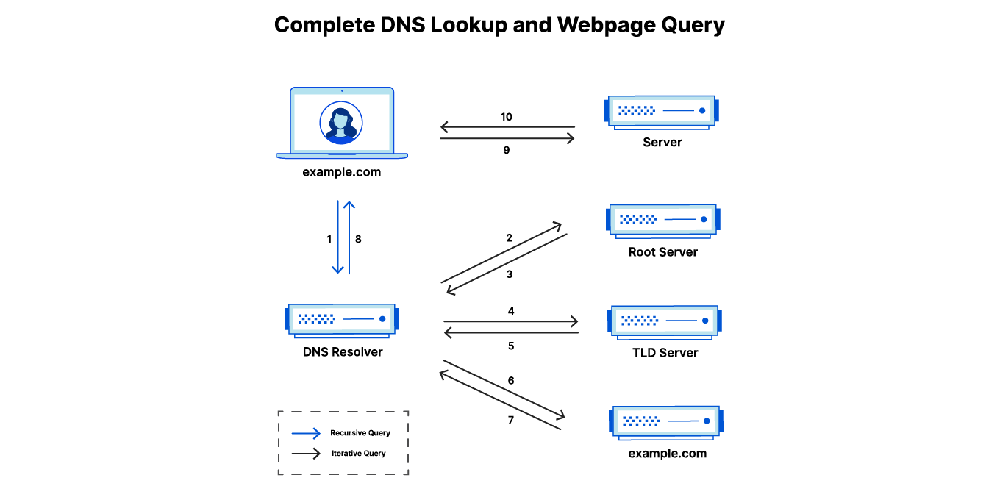

# DNS & Proxies

How the internet translates names to addresses, and how proxies sit in the middle to make it faster, safer, and smarter. View [`dns-proxy.md`](./dns-proxy.md) for a working DNS proxy in Python that forwards queries upstream, caches responses with TTL, and logs cache hits and misses.

## 🌐 What is DNS?

**Domain Name System (DNS)** translates human-readable domain names like `github.com` into IP addresses like `140.82.114.4` that computers use to actually route traffic. Without DNS, you'd need to memorize IP addresses for every site you visit.

## 🗂️ The 4 DNS Servers Involved in a Lookup

No single DNS server knows everything. A full lookup involves four distinct roles working together:

**1. DNS Recursor (Recursive Resolver)**

Think of it as a librarian tasked with tracking down a book. It receives your query from the browser, then goes out and does the legwork of contacting other servers on your behalf. Usually operated by your ISP, or a public service like Cloudflare (`1.1.1.1`) or Google (`8.8.8.8`).

**2. Root Nameserver**

The index of the library — doesn't know the answer, but knows where to look. They respond to the resolver by pointing it toward the correct TLD nameserver based on the domain extension (`.com`, `.org`, `.io`, etc.).

**3. TLD (Top Level Domain) Nameserver**

A specific rack of books in the library. Responsible for the last segment of a domain (e.g. for `github.com`, the TLD server handles `.com`). It responds by pointing the resolver to the authoritative nameserver for that specific domain.

**4. Authoritative Nameserver**

The dictionary on that rack, and the final source of truth. It holds the actual DNS records for the domain and returns the answer (the IP address) directly to the resolver, which passes it back to your browser.

```
Recursive Resolver
  │
  ▼
Root Nameserver       "Ask the .com TLD server"
  │
  ▼
TLD Nameserver        "Ask GitHub's authoritative nameserver"
  │
  ▼
Authoritative NS      "github.com → 140.82.114.4" ✅
```

## 📋 DNS Records

DNS records are instructions stored on authoritative nameservers that tell the resolver what to return for a given domain. Each record has a type, a value, and a TTL.

The most commonly encountered record types:

| Record  | Purpose                                                                                                     | Example                       |
| ------- | ----------------------------------------------------------------------------------------------------------- | ----------------------------- |
| `A`     | Maps a domain to an IPv4 address                                                                            | `github.com → 140.82.114.4`   |
| `AAAA`  | Maps a domain to an IPv6 address                                                                            | `github.com → 2606:50c0::`    |
| `CNAME` | Alias — points one domain to another domain rather than an IP. The resolver then looks up the target domain | `www.github.com → github.com` |
| `MX`    | Specifies the mail server responsible for accepting email for the domain                                    | `gmail.com → mail server`     |
| `TXT`   | Stores arbitrary text — commonly used for domain ownership verification and anti-spam policies (SPF, DKIM)  |                               |
| `NS`    | Specifies which nameservers are authoritative for the domain                                                |                               |

> [!tip]
> `CNAME` is common in system design as it lets you point a subdomain at another service without hardcoding an IP. For example, `api.yourapp.com` might CNAME to an AWS load balancer URL, so if that load balancer's IP changes, the DNS record doesn't need updating.

## ⏱️ TTL — Time To Live

Every DNS record has a **TTL** — a value in seconds that tells resolvers how long to cache the result before asking again. A TTL of `3600` means the answer is valid for 1 hour.

- **Short TTL** → fresher results, but more DNS traffic and slightly slower lookups
- **Long TTL** → fewer lookups and faster responses, but changes propagate slowly

TTL becomes critical during server migrations — if you're moving to a new IP, setting a short TTL hours before the switch ensures clients pick up the change quickly rather than being stuck with the old cached address for hours.

## 🔄 The DNS Lookup Flow


_Source: [Cloudflare](https://www.cloudflare.com/learning/dns/what-is-dns/)_

```
1.  User types "example.com" — query travels to a DNS recursive resolver
    └── resolver checks its cache → not found, proceed to step 2

2.  Resolver queries a root nameserver (.)

3.  Root nameserver responds with the address of the .com TLD nameserver

4.  Resolver makes a request to the .com TLD nameserver

5.  TLD nameserver responds with the address of example.com's authoritative nameserver

6.  Resolver sends a query to example.com's authoritative nameserver

7.  Authoritative nameserver returns the IP address for example.com
    └── resolver caches the result with its TTL — future lookups skip steps 2–7

8.  Resolver returns the IP address to the browser
    └── browser caches the result locally — future lookups skip steps 1–7

9.  Browser makes an HTTP request to the IP address

10. Server returns the webpage for browser to render ✅
```

## 🖥️ What is a DNS Proxy?

A **DNS proxy** is a middleman that sits between clients and DNS resolvers (or authoritative servers). Instead of clients querying DNS directly, they send queries to the proxy, which forwards them upstream, caches results, and can filter or transform queries along the way.

### The DNS Proxy Flow

```
Device
  │  "What's the IP for github.com?"
  ▼
Recursive DNS Resolver
  │  forwards query to...
  ▼
DNS Proxy                ← intercepts, caches, filters, load balances
  │  routes query to...
  ├─────────────────────────────────────────────────────┐
  ▼                                                     ▼
Authoritative Nameserver A              Authoritative Nameserver B
  │  (primary)                            (redundant failover)
  └─────────────────┬───────────────────────────────────┘
                    ▼
      IP address returned → back up the chain → Device
```

The two authoritative nameservers represent redundancy — if one goes down, the proxy routes to the other.

**Cloudflare 1.1.1.1**

A well-known real-world example of a public recursive resolver with proxy characteristics. Cloudflare operates `1.1.1.1` as a privacy-first DNS service — it acts as a proxy between you and upstream nameservers, caches responses globally across its network for speed, and explicitly does not log or sell query data. It's effectively a massive, globally distributed DNS proxy available to anyone.

## 🧰 Use Cases

**⚡ Caching** — Stores results of recent queries locally. When the same domain is looked up again before its TTL expires, the proxy answers immediately without a full upstream lookup.

**🛡️ Security & Content Filtering** — Can block requests to known malicious, phishing, or unwanted domains before they ever reach the client. Widely used in enterprise networks, parental controls, and school/office networks.

**⚖️ Load Balancing** — Distributes DNS queries across multiple authoritative nameservers to prevent any single one from being overwhelmed.

**🔒 Privacy** — Masks client DNS queries from being directly visible to upstream servers, as seen with Cloudflare's `1.1.1.1`.

**🌍 Geo-restriction Bypass** — Routes DNS queries through servers in different regions, making it possible to resolve domains to region-specific IPs.

**🧩 Network Segmentation** — Allows different parts of a network to have different DNS resolution behavior (e.g. internal company domains resolve differently inside vs outside the office network).

**☠️ DNS Cache Poisoning Protection** — Validates DNS responses to protect against attacks where malicious actors inject false records into a resolver's cache, redirecting users to fraudulent servers without their knowledge.

## ⚠️ Disadvantages

- **Single point of failure** — if the DNS proxy goes down, DNS resolution fails for every client routing through it. Running redundant proxies adds infrastructure complexity.
- **Added latency on cache misses** — every query that isn't cached requires a full upstream round trip through the proxy, adding a network hop compared to querying a resolver directly.
- **Cache poisoning risk** — if the proxy caches a malicious or incorrect DNS response, it serves that bad record to every client until the TTL expires. A compromised proxy is worse than a compromised individual resolver.
- **Privacy concern** — the proxy operator has full visibility into every DNS query from every client. This is by design in enterprise filtering, but a significant risk with untrusted third-party DNS proxy services.
- **Stale cache** — aggressively long TTLs can cause clients to resolve domains to outdated IPs long after a server migration has propagated elsewhere.
- **Complexity** — operating a DNS proxy requires managing cache eviction, TTL logic, upstream failover, and security hardening.

## 🔗 Connection to Load Balancers

**\*Think**: a DNS proxy is to DNS queries what a load balancer is to HTTP requests\*

|               | Load Balancer         | DNS Proxy                    |
| ------------- | --------------------- | ---------------------------- |
| **Routes**    | HTTP requests         | DNS queries                  |
| **To**        | Backend web servers   | Authoritative nameservers    |
| **Caches**    | Sometimes (CDN layer) | Yes — DNS responses with TTL |
| **Filters**   | By algorithm, health  | By domain, security policy   |
| **Protocol**  | TCP (HTTP)            | UDP (DNS, port 53)           |
| **OSI Layer** | Layer 7               | Layer 7 / Layer 3            |

## 📚 Resources

- [Cloudflare — What is DNS?](https://www.cloudflare.com/learning/dns/what-is-dns/)
- [Cloudflare — What is 1.1.1.1?](https://www.cloudflare.com/learning/dns/what-is-1.1.1.1/)
- [Cloudflare — DNS Record Types](https://www.cloudflare.com/learning/dns/dns-records/)
- [How DNS Works (comic)](https://howdns.works/)
