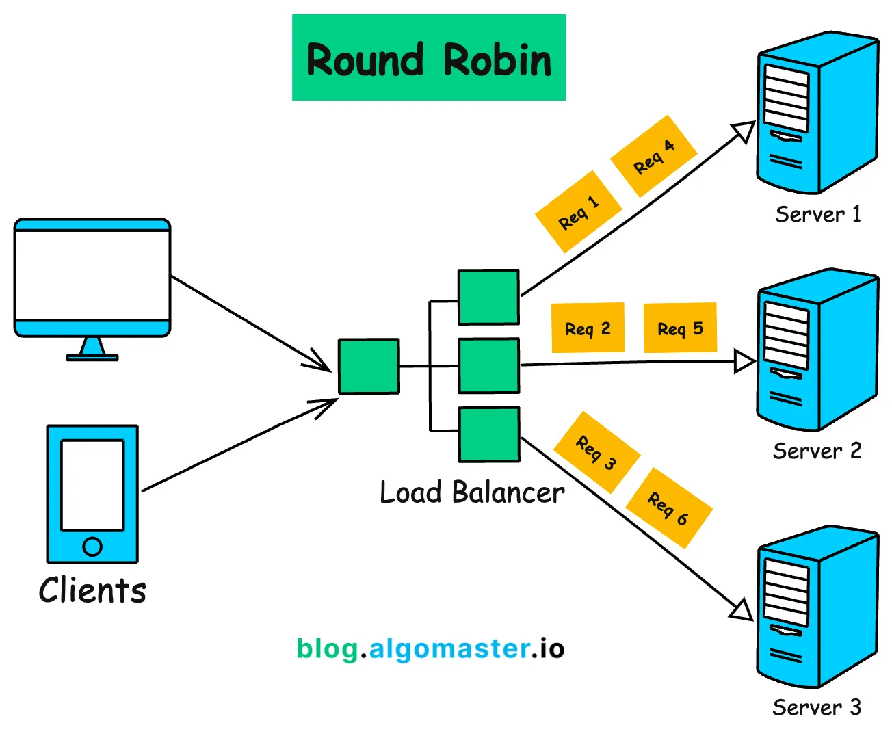
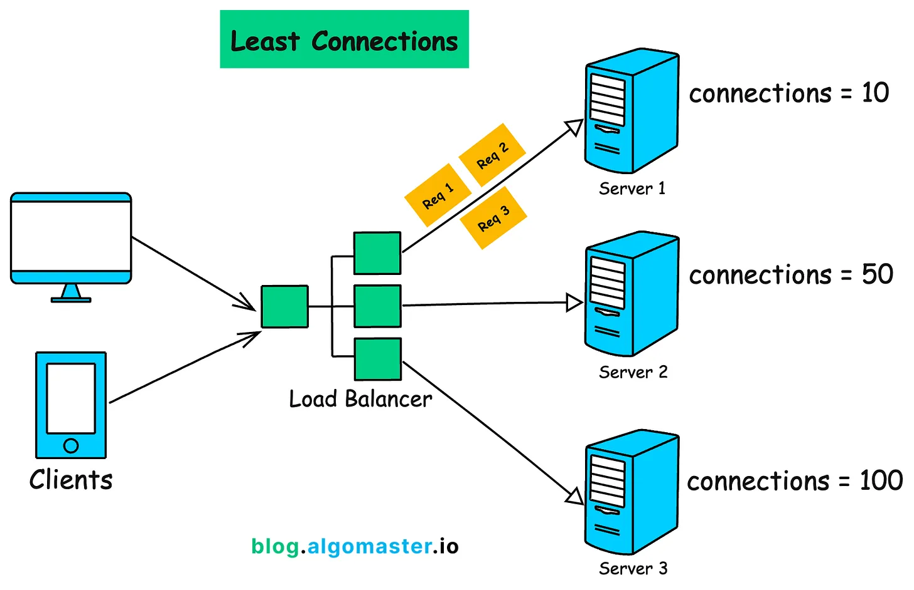

# Load Balancers

A load balancer sits in front of multiple servers and distributes incoming network traffic across them, ensuring no single server gets overwhelmed, and that failures are handled gracefully.

View [`load-balancer.md`](./load-balancer.md) for a working load balancer in Python, implementing weighted round robin, least connections, health checks with server recovery, and structured logging.

## 💭 Why Load Balancers Exist

As an application grows, a single server eventually hits its limits whether it be in CPU, memory, or bandwidth. You have two options: **scale vertically** (buy a bigger server) or **scale horizontally** (add more servers). Load balancers aid horizontal scaling by acting as the single entry point that routes traffic intelligently across your fleet.

```
Without a load balancer          With a load balancer
─────────────────────            ────────────────────

All users → Server 1             Users → Load Balancer → Server 1
            (overwhelmed)                              → Server 2
                                                       → Server 3
```

**What a load balancer gives you:**

- **Performance** — traffic is spread, no single server is a bottleneck
- **Availability** — if one server goes down, traffic reroutes automatically
- **Scalability** — add or remove servers without touching your clients
- **Flexibility** — route traffic based on load, geography, content type, and more

Real-world load balancers include **NGINX**, **HAProxy**, **AWS Elastic Load Balancer**, and **Cloudflare**.

## ⚖️ Load Balancing Algorithms

The algorithm determines _how_ the load balancer decides which server to send each request to.

---

### 🔁 Round Robin

Requests are distributed to servers sequentially in rotation — one request to each server in turn, looping back to the beginning.

```
Request 1 → Server A
Request 2 → Server B
Request 3 → Server C
Request 4 → Server A  ← loops back
```

**Best for:** Stateless applications where all servers have similar capacity and request processing time is roughly equal. Use when in need for simplicity and even distribution of load.

**Limitation:** Treats all servers equally regardless of their current load or capacity. It does not consider server load or response time.


_Source: [AlgoMaster](https://blog.algomaster.io/p/load-balancing-algorithms-explained-with-code)_

#### Variants

**Weighted Round Robin** — Each server is assigned a weight, receiving more requests for higher weights. A server with weight 3 receives 3 requests for every 1 that goes to a server with weight 1. Used when servers have different hardware capabilities.

**Dynamic Round Robin** — Weights are assigned automatically based on real-time metrics (CPU, memory) rather than a static configuration.

---

### 🔌 Least Connections

Routes each new request to whichever server currently has the fewest active connections — a live, real-time decision on every request.

```
Server A: 12 active connections
Server B:  3 active connections  ← next request goes here
Server C:  8 active connections
```

**Best for:** Environments where requests have highly variable processing times. It actively avoids sending traffic to an already-busy server.

**Tradeoff:** Requires tracking connection state of each server.


_Source: [AlgoMaster](https://blog.algomaster.io/p/load-balancing-algorithms-explained-with-code)_

---

### 🔐 IP Hashing

Uses a hash of the client's IP address to consistently map them to the same backend server on every request.

```
Client IP 203.0.113.5  → hash → Server B (always)
Client IP 198.51.100.2 → hash → Server A (always)
```

**Best for:** Applications where **session stickiness** matters — the same client must always reach the same server because state is stored locally on that server.

**Limitation:** If a server is removed, all clients hashed to that server get rerouted and lose any local session state. There can be uneven load distribution, giving certain servers more traffic than others. Many modern architectures have shifted to storing session in a shared external store like Redis.

---

### 📊 Algorithm Comparison

| Algorithm            | Best For                      | Complexity | Session Sticky |
| -------------------- | ----------------------------- | ---------- | -------------- |
| Round Robin          | Equal servers, simple traffic | Low        | ❌             |
| Weighted Round Robin | Mixed server capacities       | Low-Medium | ❌             |
| Least Connections    | Variable request duration     | Medium     | ❌             |
| IP Hashing           | Session-dependent apps        | Low        | ✅             |

> [!important]
> This is only a fraction of existing load balancing algorithms, and there exists additional static/dynamic algorithms, alongside different variants. Choosing the right load balancing algorithm depends on the specific needs and characteristics of the system, including server capabilities, workload distribution, and performance requirements.

## 🏥 Health Checks

A load balancer is only useful if it knows which servers are actually alive. Health checks periodically ping each backend server, automatically remove unhealthy ones from the pool, and re-add them when they recover. Without health checks, the load balancer would keep routing traffic to dead servers, causing errors for users.

```
Every 10 seconds:
  → ping Server A → 200 OK   ✅ keep in pool
  → ping Server B → timeout  ❌ remove from pool
  → ping Server C → 200 OK   ✅ keep in pool

Later:
  → ping Server B → 200 OK   ✅ add back to pool
```

## 🧩 Layer 4 vs Layer 7

Load balancers can operate at different layers of the OSI model:

**Layer 4 (Transport)** — Routes based on IP address and port only. Fast but limited — it doesn't look at the content of requests.

**Layer 7 (Application)** — Routes based on HTTP content: URL path, headers, cookies, query parameters. Slower but far more flexible. You can route `/api/*` to one server cluster and `/static/*` to another.

## 📚 Resources

- [ClouDNS — Round Robin Load Balancing](https://www.cloudns.net/blog/round-robin-load-balancing/)
- [AWS — What is Load Balancing?](https://aws.amazon.com/what-is/load-balancing/)
- [Cloudflare — What is Load Balancing?](https://www.cloudflare.com/learning/performance/what-is-load-balancing/)
- [AlgoMaster — Load Balancing Algorithms Explained](https://blog.algomaster.io/p/load-balancing-algorithms-explained-with-code)
- [The System Design Primer — Load Balancer](https://github.com/donnemartin/system-design-primer?tab=readme-ov-file#load-balancer)
