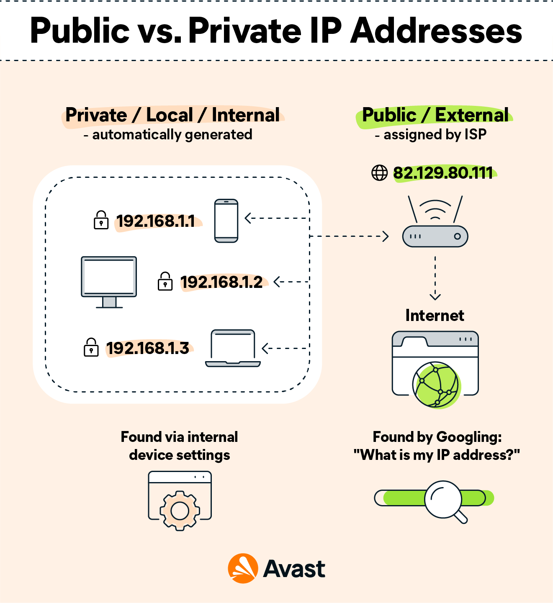
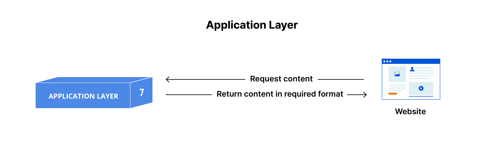
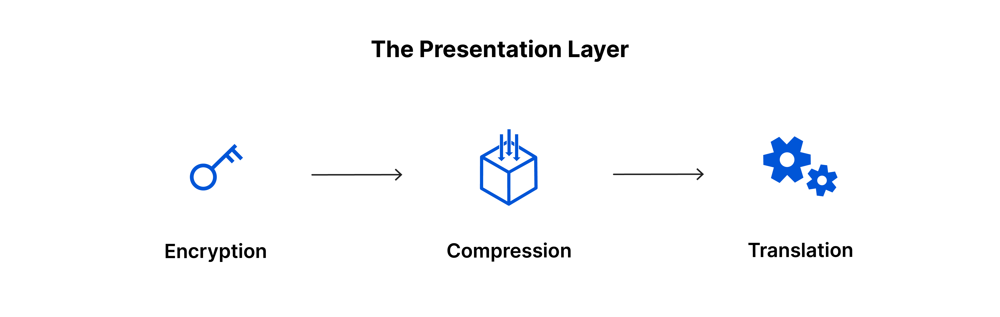
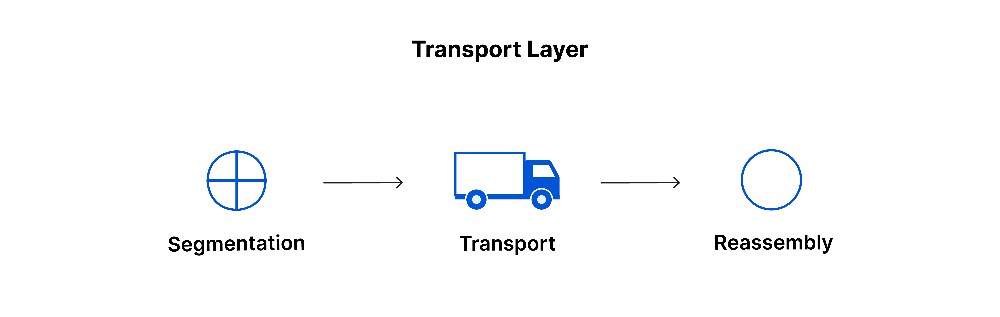
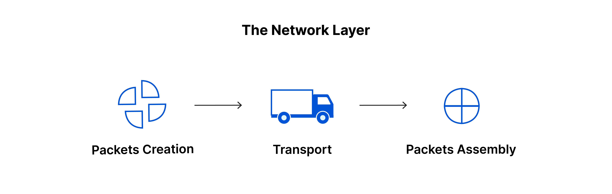
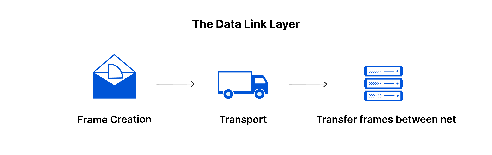
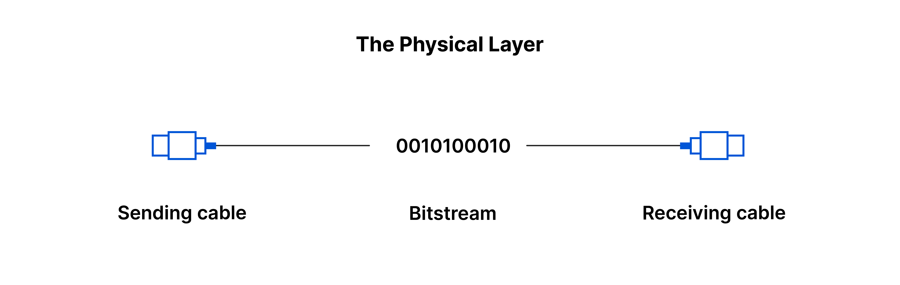
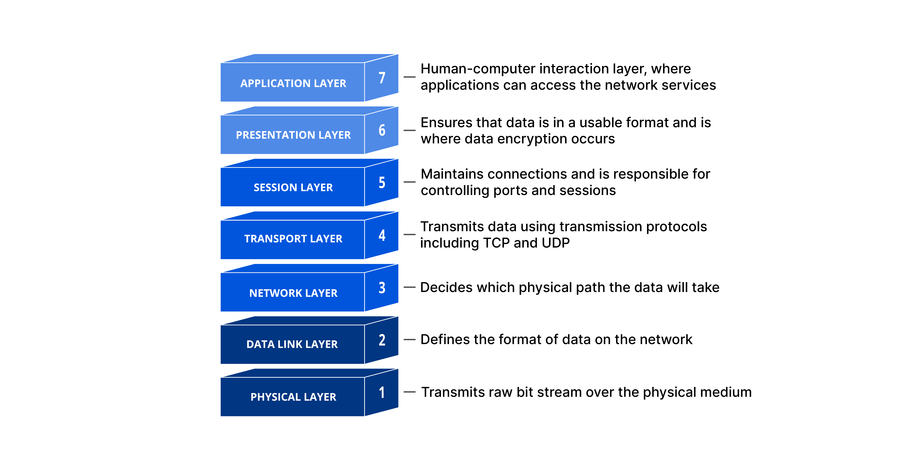

# Networking Fundamentals

Foundational networking concepts — IP addressing, OSI model, TCP vs UDP, etc. — are essential in understanding other system design concepts, from how load balancers route traffic to how DNS resolves a domain name.

View [`tcp-vs-udp.md`](./tcp-vs-udp.md) to observe TCP vs UDP tradeoffs in a Python demo.

## 🌐 IP Addresses

An **Internet Protocol (IP) address** is a unique identifier assigned to every device on a network. It's how devices find and communicate with each other.

### IPv4 vs IPv6

IPv6 was created due to shortage of IPv4 addresses, but most modern systems support both.

|                   | IPv4                   | IPv6                       |
| ----------------- | ---------------------- | -------------------------- |
| **Format**        | `192.168.1.1` (32-bit) | `2001:0db8::1` (128-bit)   |
| **Address space** | ~4.3 billion addresses | ~340 undecillion addresses |
| **Status**        | Exhausted              | Increasingly adopted       |

### Public vs Private IPs

- **Public IP** — globally unique, routable on the internet. Used to communicate outside a local network.
- **Private IP** — only valid within a local network (e.g. `192.168.x.x`, `10.x.x.x`). Used to communicate within a local network.
- **`127.0.0.1`** — default IPv4 loopback address (`localhost`).


_Source: [Avast](https://www.avast.com/c-ip-address-public-vs-private)_

### Subnets & NAT

A **subnet** (subnetwork) is a logical subdivision of a larger network. Breaking a network into subnets improves organization, security, and traffic efficiency — for example, AWS VPCs use subnets to isolate different parts of an application from each other.

**NAT (Network Address Translation)** is how multiple devices on a private network share a single public IP address. Your home router performs NAT — your laptop has a private IP, but to the outside internet it appears as your router's single public IP.

### Ports

While an IP address identifies a _device_, a **port number** identifies a specific _application_ on that device. Together they form a socket: `192.168.1.1:8080`.

Some well-known ports: `80` (HTTP), `443` (HTTPS), `53` (DNS), `22` (SSH).

## 🧱 The OSI Model

The **Open Systems Interconnection (OSI) model** is a conceptual framework that describes how data travels between two devices across a network. It breaks the process into 7 distinct layers, each with a specific responsibility. Data passes through each layer on the way out (sending), and back up through each layer on the way in (receiving).

While the modern Internet does not strictly follow the OSI Model, it is still useful in breaking down network problems and isolating the source of trouble.

```
Sending Device                          Receiving Device
──────────────                          ────────────────
7. Application  ← data starts here      7. Application  ← data ends here
       │                                       ▲
6. Presentation                         6. Presentation
       │                                       │
5. Session                              5. Session
       │                                       │
4. Transport                            4. Transport
       │                                       │
3. Network                              3. Network
       │                                       │
2. Data Link                            2. Data Link
       │                                       │
1. Physical  ────── bits on wire ──────► 1. Physical
```

**Mnemonic:** _All People Seem To Need Data Processing_

---

### Layer 7 — Application ("User Interface")

The only layer that directly interacts with data from the user. Responsible for the protocols and data manipulation that software applications rely on to present meaningful data to the user.

When you type `google.com` into a browser, the browser constructs an HTTP request and initiates a DNS lookup to resolve the domain to an IP address.


_Source: [Cloudflare](https://www.cloudflare.com/learning/ddos/glossary/open-systems-interconnection-model-osi/)_

**Key protocols:**

- **HTTP / HTTPS** — client sends a request (`GET`, `POST`, `PUT`, `DELETE`), server responds with a status code and content
- **DNS** — translates domain names to IP addresses
- **DHCP** — automatically assigns IP addresses to devices joining a network
- **SMTP / IMAP** — email sending and receiving
- **FTP** — file transfer

**Common issues:** DNS resolution failures, HTTP errors (404, 401, 500), certificate errors on HTTPS sites.

---

### Layer 6 — Presentation ("Data translation")

Acts as the translator between the network and the application. Ensures data sent by one system can be understood by another, regardless of how each internally represents data.


_Source: [Cloudflare](https://www.cloudflare.com/learning/ddos/glossary/open-systems-interconnection-model-osi/)_

**Responsibilities:**

- **Encoding/Decoding** — converts data formats (ASCII, Unicode, Base64) into a syntax that the application layer of the receiving device can understand.
- **Encryption/Decryption** — TLS/SSL secures data at this layer before transmission
- **Compression** — reduces data size (JPEG, MP3, GZIP) to improve speed

**Common issues:** Encoding mismatches between systems, SSL/TLS certificate errors, serialization errors.

---

### Layer 5 — Session ("Managing Connections")

Manages the session, the persistent connection between two communicating applications. Ensures all data being exchanged is transferred, then promptly closes to avoid wasting resources. Also handles synchronization checkpoints so interrupted transfers can resume rather than restart.


_Source: [Cloudflare](https://www.cloudflare.com/learning/ddos/glossary/open-systems-interconnection-model-osi/)_

**Key protocols:** NetBIOS, RPC (Remote Procedure Call), SIP (used for VoIP calls), PPTP (VPNs)

**Associated devices:** Firewalls, proxy servers, session border controllers

**Common issues:**

- **Session hijacking** — attacker steals a valid session token to impersonate a user. Solution: enforce HTTPS + HSTS, use secure and `HttpOnly` cookie flags.
- Dropped connections from poor session management
- High latency in session setup hurts real-time apps like video calls

---

### Layer 4 — Transport ("Reliable Data Transfer")

Manages end-to-end communication between applications on two devices. Breaks data into **segments** for Layer 3 and ensures delivery to the correct application using port numbers. Conversely, reassembles received segments into data for Layer 5.

Also responsible for flow control (control optimal transmission speed) and error control (request retransmission if data received is incomplete) for inter-network communication.


_Source: [Cloudflare](https://www.cloudflare.com/learning/ddos/glossary/open-systems-interconnection-model-osi/)_

**Key protocols:** TCP, UDP

**Common issues:**

- **Congestion** — too much traffic overwhelming the network. TCP addresses this with congestion control that throttles the sending rate automatically.
- **Packet loss** — TCP retransmits lost packets; UDP simply drops them and moves on.
- **Out-of-order delivery** — packets can take different network paths and arrive out of sequence. TCP uses sequence numbers to reassemble them correctly.

> [!note]
> HTTP, HTTPS, FTP, SMTP, and DNS are _application layer_ protocols — they run _on top of_ TCP or UDP. They are not themselves transport layer protocols.

---

### Layer 3 — Network ("Path Determination")

Responsible for routing data across **different** networks — unnecessary if devices are on same network. Packages data into **packets**, assigns source and destination IP addresses, and determines the best path to the destination via **routing**.


_Source: [Cloudflare](https://www.cloudflare.com/learning/ddos/glossary/open-systems-interconnection-model-osi/)_

**Key protocols:**

- **IPv4 / IPv6** — addressing schemes for identifying devices across networks
- **ICMP** (Internet Control Message Protocol) — error reporting and diagnostics (`ping` uses this)
- **IGMP** (Internet Group Message Protocol) — used to manage multicast group memberships

**Devices:** Routers

**Common issues:**

- Incorrect IP configuration → can't communicate outside local subnet
- Routing table errors → packets can't find their destination
- Firewall / ACL rules silently dropping packets

---

### Layer 2 — Data Link ("Physical Addressing")

While Layer 3 gets data across networks, Layer 2 gets data from the router to the specific device within a local network.

Once a packet arrives via Layer 3, Layer 2 figures out which physical device on that network should receive it using **MAC addresses** — hardware identifiers burned into every network interface card — rather than IP addresses. Packets are broken down into smaller units called **frames** for transmission. Conversely, raw bits from Layer 1 are reassembled into frames, checked for errors, stripped of header, and the packets are passed up to Layer 3.

Similar to Layer 4, also responsible for flow control and error checking but within the local network as opposed to across networks end-to-end.

Split into two sublayers:

- **MAC** (Media Access Control) — controls how devices share the physical medium and handles MAC address based delivery
- **LLC** (Logical Link Control) — manages flow control, error checking, and acts as the interface between the MAC sublayer and Layer 3 above it


_Source: [Cloudflare](https://www.cloudflare.com/learning/ddos/glossary/open-systems-interconnection-model-osi/)_

**Key protocols:** Ethernet, PPP (Point-to-Point Protocol), HDLC

**Devices:** Switches, bridges, NICs (network interface cards)

**Common issues:**

- Operates only within a local network — cannot route across different networks
- MAC address conflicts
- Error detection (frames may be dropped) but not always correction

---

### Layer 1 — Physical ("Bits in a wire")

The lowest layer, transmitting raw binary data (0s and 1s) as **physical** signals across a medium. Electrical signals over copper cable, light pulses over fiber optic, radio waves over Wi-Fi.


_Source: [Cloudflare](https://www.cloudflare.com/learning/ddos/glossary/open-systems-interconnection-model-osi/)_

**Standards:**

- **IEEE 802.3** — Wired Ethernet
- **IEEE 802.11** — Wireless Ethernet (Wi-Fi)
- **USB** — Universal serial bus standard
- **HDMI** — Uncompressed audio/video transmission

**Common issues:**

- Damaged or incompatible cables
- Hardware failure (water damage, short circuits)
- **Wiretapping** — intercepting physical signals to eavesdrop. Solution: encrypt data at higher layers (TLS) or use a VPN.

---

### OSI Model Summary

Data must travel down the seven layers of the OSI Model on the sending device and then travel up the seven layers on the receiving end.

Example provided by Cloudflare:

```
Mr. Cooper sends Ms. Palmer an email:

Sending (down the stack):
  7. Application   → email app formats message, SMTP selected as protocol
  6. Presentation  → data compressed and encrypted
  5. Session       → communication session opened
  4. Transport     → data split into segments
  3. Network       → segments split into packets, IP addresses assigned
  2. Data Link     → packets split into frames, MAC addresses assigned
  1. Physical      → frames converted to bits, sent over wire/wifi

Receiving (up the stack):
  1. Physical      → raw bits received from physical medium
  2. Data Link     → bits reassembled into frames
  3. Network       → frames reassembled into packets
  4. Transport     → packets reassembled into segments, then into full data
  5. Session       → data passed up, session closed
  6. Presentation  → data decompressed and decrypted
  7. Application   → email app displays message to Ms. Palmer ✅
```


_Source: [Cloudflare](https://www.cloudflare.com/learning/ddos/glossary/open-systems-interconnection-model-osi/)_

## 🚦 TCP vs UDP

Both TCP and UDP are both Layer 4 transport protocols, but take different approaches in moving data.

### TCP — Transmission Control Protocol

Before sending any data, TCP performs a **3-way handshake** to establish a connection:

```
Client          Server
  │── SYN ──────► │
  │◄─ SYN-ACK ────│
  │── ACK ──────► │
  │  (connected)  │
```

After connection, every packet is acknowledged. Lost packets are retransmitted. Packets are reordered if they arrive out of sequence. While TCP is reliable, this process adds overhead.

**Use cases:** HTTP/HTTPS, email, file transfer — anything where data correctness matters more than raw speed.

**Disadvantages of TCP:**

- Higher overhead from the handshake and per-packet acknowledgment mechanism
- Head-of-line blocking — if one packet is lost, all subsequent packets wait for it to be retransmitted before delivery continues, even if they've already arrived
- More memory-intensive — the OS must maintain state for every open connection
- Slower to establish — latency-sensitive apps pay the handshake cost on every new connection

### UDP — User Datagram Protocol

UDP fires packets at the destination with no handshake, no acknowledgment, or no guaranteed ordering. Often used for time-sensitive transmissions by not formally establishing a connection before transferring data.

**Use cases:** Video calls, live streaming, online gaming, DNS lookups — scenarios where speed matters more than perfection and a dropped packet is better than a delayed one.

**Disadvantages of UDP:**

- No delivery guarantee — lost packets are silently dropped with no notification to the sender
- No ordering — packets can arrive out of sequence and the application must handle reordering itself
- No built-in congestion control — a UDP sender can flood the network without backing off, potentially worsening congestion for everyone (DDoS)
- Any reliability the application needs must be implemented from scratch in userspace

### Side-by-Side Comparison

| Feature            | TCP                   | UDP                                 |
| ------------------ | --------------------- | ----------------------------------- |
| Connection setup   | 3-way handshake       | None                                |
| Delivery guarantee | ✅ Yes                | ❌ No                               |
| Ordered delivery   | ✅ Yes                | ❌ No                               |
| Error recovery     | ✅ Retransmits        | ❌ Drops                            |
| Speed              | Slower                | Faster                              |
| Overhead           | Higher                | Lower                               |
| **Use cases**      | HTTP, email, SSH, FTP | Video calls, gaming, DNS, streaming |

## 📚 Resources

- [MDN — HTTP Overview](https://developer.mozilla.org/en-US/docs/Web/HTTP/Overview)
- [Avast — Public vs. Private IP Addresses](https://www.avast.com/c-ip-address-public-vs-private)
- [GeeksForGeeks — Pubic and Private IP addresses](https://www.geeksforgeeks.org/computer-networks/difference-between-private-and-public-ip-addresses/)
- [KodeKloud — The OSI Model: 7 Layers Explained](https://youtu.be/xuan1dN9bKw?si=-hVtFMCJUsrScTMF)
- [Cloudflare — What is the OSI Model?](https://www.cloudflare.com/learning/ddos/glossary/open-systems-interconnection-model-osi/)
- [Storm Streaming — TCP/IP and UDP](https://www.stormstreaming.com/blog/tcp-and-upd-what-are-they/)
