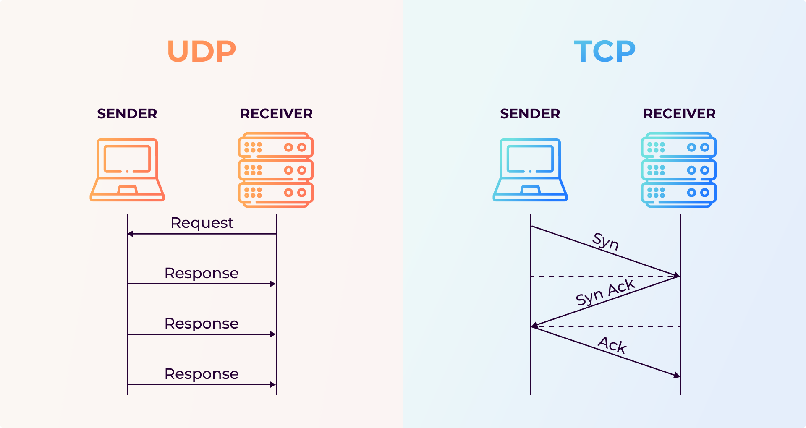

# TCP vs UDP

Observe the fundamental difference between TCP and UDP: TCP guarantees delivery of every message while UDP silently drops packets while dumping data.

This quick demonstration was implemented with the assistance of Claude.


_Source: [Storm Streaming](https://www.stormstreaming.com/blog/tcp-and-upd-what-are-they/)_

## ⚙️ Configuration

At the top of `tcp-vs-udp.py`:

```python
MODE = "tcp"      # options: "tcp" or "udp"
LOSS_RATE = 0.4   # simulated packet loss — only applies to udp (0.0 to 1.0)
```

Switch `MODE` to run the TCP or the UDP demo. `LOSS_RATE` controls how aggressively packets are dropped in the UDP demo — `0.4` means 40% of packets are silently discarded on the server side.

## ⚡ Getting Started

```bash
# Make sure you are in the right directory
cd networking

# Run the demo with configs applied
python3 tcp-vs-udp.py
```

## 📍 Key Code Concepts

### Socket Type

The entire TCP vs UDP distinction comes down to one line when creating the socket:

```python
# SOCK_STREAM = TCP (connection-oriented, reliable_
socket.socket(socket.AF_INET, socket.SOCK_STREAM)

# SOCK_DGRAM = UDP (connectionless, no guarantees)
socket.socket(socket.AF_INET, socket.SOCK_DGRAM)
```

### TCP Handshake

The server must be listening before the client can connect at all.

```python
server.listen(1)
conn, addr = server.accept()  # blocks until a client connects
```

### UDP Dump

The client sends and immediately moves on regardless of whether the server received it.

```python
client.sendto(msg.encode(), (HOST, PORT))
```

### Simulated Packet Loss

The server randomly discards incoming packets to simulate real network conditions. (UDP does not give feedback to the user of loss packets)

```python
if random.random() < LOSS_RATE:
    print(f"[SERVER] ✗ Dropped packet (simulated loss)")
else:
    print(f"[SERVER] ✓ Received: {data.decode()}")
```

## 📊 Expected Output

### TCP (`MODE = "tcp"`)

Every message arrives every run.

```
=== TCP Demo ===

[SERVER] Waiting for connection...
[CLIENT] Connected to server
[SERVER] Connected to ('127.0.0.1', XXXXX)
[CLIENT] Sending: Message 1
[SERVER] Received: Message 1
[CLIENT] Sending: Message 2
[SERVER] Received: Message 2
[CLIENT] Sending: Message 3
[SERVER] Received: Message 3
[CLIENT] Sending: Message 4
[SERVER] Received: Message 4
[CLIENT] Sending: Message 5
[SERVER] Received: Message 5
[CLIENT] All messages sent.
[SERVER] Connection closed.
```

### UDP (`MODE = "udp"`)

Results vary every run.

```
=== UDP Demo ===

[SERVER] Listening on 127.0.0.1:9002 (simulating 40% packet loss)
[CLIENT] Sending: Message 1
[SERVER] ✓ Received: Message 1
[CLIENT] Sending: Message 2
[SERVER] ✗ Dropped packet (simulated loss)
[CLIENT] Sending: Message 3
[SERVER] ✓ Received: Message 3
[CLIENT] Sending: Message 4
[SERVER] ✗ Dropped packet (simulated loss)
[CLIENT] Sending: Message 5
[SERVER] ✓ Received: Message 5

[SERVER] Done. Received 3/5 messages.
[SERVER] Shutting down.
[CLIENT] All messages sent — but did they all arrive?
```

> **See also:** View [2600-chat-app](https://github.com/lebuckman/2600-chat-app) repo, a Node.js TCP chat server inspired by a C implementation from a Systems Programming class. Showcases TCP's guaranteed, ordered delivery.
